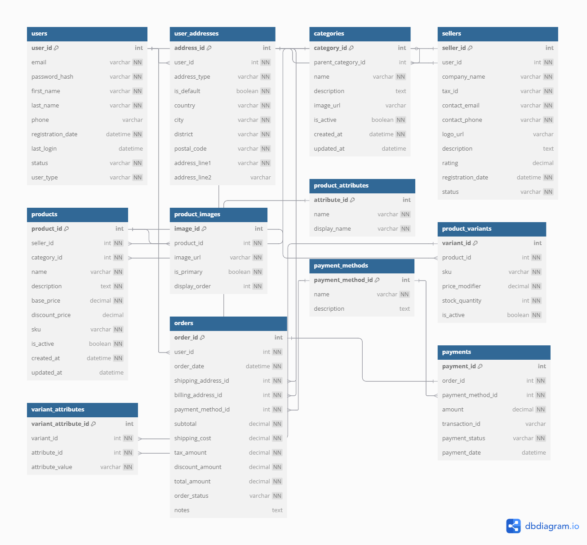

# E-Ticaret Veritabanı Örneği

Bu repo, kapsamlı bir e-ticaret veritabanı modellemesini içermektedir. Veritabanı modeli, Chen ER Diyagramı ve Kazayağı modeli kullanılarak oluşturulmuştur.

## Veritabanı Şeması



## İçerik

- [Veritabanı Şeması](./schema)
- [ER Diyagramları](./diagrams)
- [SQL Dosyaları](./sql)
- [Örnek Veri](./data)

## Veritabanı Modeli Hakkında

Bu e-ticaret veritabanı aşağıdaki ana özellikleri içermektedir:

- Kullanıcı yönetimi (müşteriler, satıcılar, yöneticiler)
- Ürün kataloğu (kategoriler, ürünler, varyantlar)
- Sipariş işleme (sepet, sipariş, ödeme)
- Stok yönetimi
- Değerlendirme ve yorumlar
- Kampanya ve indirim sistemi
- Tedarikçi yönetimi
- Kargo ve teslimat takibi

## Tablolar ve İlişkiler

Veritabanı şeması aşağıdaki ana tabloları içerir:

- `users` - Kullanıcı bilgileri
- `user_addresses` - Kullanıcı adresleri
- `categories` - Ürün kategorileri
- `sellers` - Satıcı bilgileri
- `products` - Ürün bilgileri
- `product_variants` - Ürün varyantları
- `orders` - Sipariş bilgileri
- `payments` - Ödeme bilgileri
- `reviews` - Ürün değerlendirmeleri
- Ve daha fazlası...

## Veri Modelleme Yaklaşımları

Bu projedeki veritabanı şeması, iki farklı ER modelleme yaklaşımı kullanılarak dokümante edilmiştir:

1. **Chen ER Modeli** - Varlıklar ve ilişkiler için klasik gösterim
2. **Kazayağı (Crow's Foot) Modeli** - İlişki kardinalitelerini görsel olarak gösteren modern yaklaşım

## Kurulum ve Kullanım

Bu repo, veritabanı tasarımı öğrenmek ve öğretmek için referans olarak kullanılabilir. Sistemin kurulumu için:

1. SQL dosyalarını kullanarak veritabanı şemasını oluşturun
   ```sql
   mysql -u username -p database_name < sql/schema.sql
   ```

2. Örnek verileri yükleyin
   ```sql
   mysql -u username -p database_name < sql/sample_data.sql
   ```

3. ER diyagramlarını inceleyerek veritabanı yapısını anlayın


## İletişim

- [GitHub](https://github.com/tahamhl)


